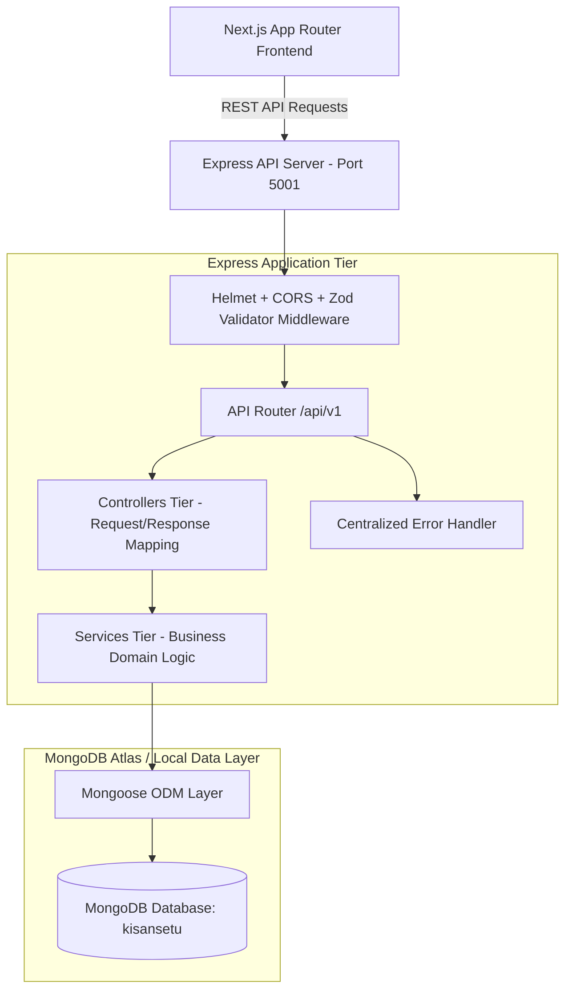

# KisanSetu — Backend Architecture & MongoDB Data Layer Blueprint

---

## 1. System Architecture Flow

KisanSetu implements a modular, tiered backend architecture separating HTTP request handlers, controllers, services, database models, and configuration.



---

## 2. Environment Variables & Configuration

The backend reads configuration from `server/.env` and validates all keys at server boot using Zod (`server/src/config/env.ts`).

| Variable Name | Default / Example Value | Description / Purpose |
|---|---|---|
| `PORT` | `5001` | HTTP listening port for Express API server (set to 5001 to prevent macOS AirPlay 5000 conflict). |
| `MONGODB_URI` | `mongodb://127.0.0.1:27017/kisansetu` | Primary MongoDB connection URI (Atlas cloud or local instance). |
| `JWT_SECRET` | `kisansetu_jwt_super_secret_key_2026` | Secret key used for signing & verifying JWT tokens. |
| `CLIENT_URL` | `http://localhost:3000` | Allowed CORS origin for Next.js frontend app. |
| `NODE_ENV` | `development` | Application runtime environment (`development`, `production`, `test`). |

---

## 3. MongoDB Collection Architecture (11 Models)

### 1. `User` Collection (`server/src/models/User.ts`)
- **Purpose**: Identity and authentication master record for Farmers, Operators, and Admins.
- **Fields**: `_id`, `name`, `phone` (Unique Index), `email`, `passwordHash`, `role` (`FARMER`, `OPERATOR`, `ADMIN`), `language` (`en`, `hi`), `isActive`, `createdAt`, `updatedAt`.
- **Primary Indexes**: Unique index on `phone`.

### 2. `Farmer` Collection (`server/src/models/Farmer.ts`)
- **Purpose**: Agricultural profile and location data linked to a `User` identity.
- **Fields**: `_id`, `userId` (Ref: User), `farmerId` (Unique Index), `village`, `district` (Index), `state`, `preferredLanguage`, `createdAt`, `updatedAt`.
- **Primary Indexes**: Compound index on `userId`, unique index on `farmerId`, index on `district`.

### 3. `ProcurementCentre` Collection (`server/src/models/ProcurementCentre.ts`)
- **Purpose**: Government Mandi procurement hub registration and counter details.
- **Fields**: `_id`, `name`, `code` (Unique Index), `district` (Index), `state` (Index), `address`, `location` (`latitude`, `longitude`), `dailyCapacity`, `activeCounters`, `isActive`, `createdAt`, `updatedAt`.
- **Primary Indexes**: Unique index on `code`, indexes on `district` and `state`.

### 4. `Slot` Collection (`server/src/models/Slot.ts`)
- **Purpose**: Time-slot capacity allocations per procurement centre to regulate farmer arrivals.
- **Fields**: `_id`, `centreId` (Ref: ProcurementCentre), `date`, `startTime`, `endTime`, `capacity`, `bookedCount`, `status` (`AVAILABLE`, `LIMITED`, `FULL`, `CLOSED`), `createdAt`, `updatedAt`.
- **Primary Indexes**: Compound index on `{ centreId: 1, date: 1 }`.

### 5. `Booking` Collection (`server/src/models/Booking.ts`)
- **Purpose**: Reservation record linking a farmer, crop, quintal quantity, and time slot.
- **Fields**: `_id`, `bookingReference` (Unique Index), `farmerId` (Ref: Farmer), `centreId` (Ref: ProcurementCentre), `slotId` (Ref: Slot), `crop`, `estimatedQuantity`, `vehicleNumber`, `status` (`CONFIRMED`, `CANCELLED`, `COMPLETED`, `NO_SHOW`), `createdAt`, `updatedAt`.
- **Primary Indexes**: Unique index on `bookingReference`, index on `farmerId` and `centreId`.

### 6. `QueueToken` Collection (`server/src/models/QueueToken.ts`)
- **Purpose**: Real-time token state and position tracking for mandi FIFO queue management.
- **Fields**: `_id`, `tokenNumber`, `bookingId` (Ref: Booking), `centreId` (Ref: ProcurementCentre), `queueDate`, `position`, `status` (`WAITING`, `CALLED`, `ARRIVED`, `WEIGHING`, `QUALITY_CHECK`, `PROCUREMENT_COMPLETED`, `PAYMENT_PENDING`, `COMPLETED`, `CANCELLED`), `calledAt`, `arrivedAt`, `completedAt`, `estimatedWaitMinutes`, `createdAt`, `updatedAt`.
- **Primary Indexes**: Compound indexes on `{ centreId: 1, queueDate: 1 }` and `{ centreId: 1, status: 1 }`.

### 7. `Procurement` Collection (`server/src/models/Procurement.ts`)
- **Purpose**: Crop delivery receipt recording accepted net quintals and calculated MSP value.
- **Fields**: `_id`, `bookingId` (Ref: Booking), `farmerId` (Ref: Farmer), `centreId` (Ref: ProcurementCentre), `crop`, `quantity`, `ratePerQuintal`, `totalAmount`, `procurementDate`, `status`, `createdAt`, `updatedAt`.
- **Primary Indexes**: Indexes on `bookingId`, `farmerId`, and `centreId`.

### 8. `QualityCheck` Collection (`server/src/models/QualityCheck.ts`)
- **Purpose**: Quality assessor report logging moisture content and grain grade (`GRADE_A`, `GRADE_B`, `REJECTED`).
- **Fields**: `_id`, `procurementId` (Ref: Procurement), `grade`, `moisturePercentage`, `qualityStatus`, `remarks`, `checkedBy` (Ref: User), `checkedAt`, `createdAt`, `updatedAt`.
- **Primary Indexes**: Index on `procurementId`.

### 9. `Payment` Collection (`server/src/models/Payment.ts`)
- **Purpose**: Direct Benefit Transfer (DBT) payment status tracking to Aadhaar-linked bank accounts.
- **Fields**: `_id`, `procurementId` (Ref: Procurement), `farmerId` (Ref: Farmer), `amount`, `method`, `status` (`PENDING`, `PROCESSING`, `PAID`, `FAILED`), `transactionReference` (UTR), `paidAt`, `createdAt`, `updatedAt`.
- **Primary Indexes**: Indexes on `procurementId`, `farmerId`, and `status`.

### 10. `Notification` Collection (`server/src/models/Notification.ts`)
- **Purpose**: SMS and push notification log stream for queue calls and payment alerts.
- **Fields**: `_id`, `userId` (Ref: User), `type`, `title`, `message`, `data`, `read` (Boolean), `createdAt`, `updatedAt`.
- **Primary Indexes**: Compound index on `{ userId: 1, read: 1, createdAt: -1 }`.

### 11. `AuditLog` Collection (`server/src/models/AuditLog.ts`)
- **Purpose**: Immutable audit log stream for operator actions, weight overrides, and compliance reporting.
- **Fields**: `_id`, `actorId` (Ref: User), `actorRole`, `action`, `entityType`, `entityId`, `metadata`, `createdAt`.
- **Primary Indexes**: Index on `{ createdAt: -1 }`.

---

## 4. API Endpoints Foundation

### Health Check Endpoint
- **URL**: `GET /api/health`
- **Response Format**:
  ```json
  {
    "status": "ok",
    "service": "kisansetu-api",
    "timestamp": "2026-09-18T19:01:13.457Z"
  }
  ```

### Error Responses Format
- **404 Not Found**:
  ```json
  {
    "status": "error",
    "error": "NOT_FOUND",
    "message": "Cannot GET /api/unknown-endpoint",
    "timestamp": "2026-09-18T19:01:30.591Z"
  }
  ```

---

## 5. How to Run Backend & Verify Connection

1. Navigate to the `server/` directory:
   ```bash
   cd server
   ```
2. Install dependencies:
   ```bash
   npm install
   ```
3. Configure your MongoDB Atlas or Local URI in `server/.env`:
   ```env
   PORT=5001
   MONGODB_URI=mongodb+srv://<user>:<password>@cluster.mongodb.net/kisansetu
   ```
4. Run in development mode with auto-reload:
   ```bash
   npm run dev
   ```
5. Test health endpoint:
   ```bash
   curl http://localhost:5001/api/health
   ```
