# KisanSetu — Information Architecture & Screen Inventory

---

## 1. Information Architecture Overview

KisanSetu implements role-specific information architecture designed to maximize operational efficiency and eliminate navigation ambiguity.

```mermaid
graph TD
    Root[KisanSetu Platform]
    
    Root --> FarmerApp[1. Farmer Mobile Web App]
    Root --> OperatorApp[2. Operator Desktop/Tablet Web App]
    Root --> AdminApp[3. Admin & Official Portal]

    FarmerApp --> F1[Dashboard / Home]
    FarmerApp --> F2[Book Slot]
    FarmerApp --> F3[My Queue & Live Token]
    FarmerApp --> F4[Procurement History]
    FarmerApp --> F5[Payment Status]
    FarmerApp --> F6[Notifications & Alerts]
    FarmerApp --> F7[Profile & Language]

    OperatorApp --> O1[Operator Dashboard]
    OperatorApp --> O2[Live Queue Manager]
    OperatorApp --> O3[Farmer Arrival & Gate Entry]
    OperatorApp --> O4[Weighing Logger]
    OperatorApp --> O5[Quality Inspection]
    OperatorApp --> O6[Payment Processing Handoff]

    AdminApp --> A1[District Command Dashboard]
    AdminApp --> A2[Centre Management]
    AdminApp --> A3[Real-Time Analytics & Heatmaps]
    AdminApp --> A4[Farmer Registry]
    AdminApp --> A5[Payment Disbursal Monitor]
    AdminApp --> A6[Audit Logs & System Settings]
```

---

## 2. Role-Specific Navigation Systems

### A. Farmer Navigation (Mobile Bottom Navigation)
Optimized for single-thumb mobile operation with large 48px icons and dual-language labels.

| Nav Item | Target Route | Purpose / Key Components |
|---|---|---|
| 🏠 **Home** | `/farmer/dashboard` | Active booking card, quick actions, nearest mandi status. |
| 📅 **Book Slot** | `/farmer/book-slot` | Centre selector, date picker, slot grid, crop quantity input. |
| 🎫 **Live Queue** | `/farmer/queue` | Live token banner, position counter, EWT countdown, QR code. |
| 📄 **Procurements** | `/farmer/procurements` | Past receipts, weight logs, quality grade certificates. |
| 💳 **Payments** | `/farmer/payments` | DBT payment status cards, bank account confirmation, UTR numbers. |

### B. Operator Navigation (Desktop Sidebar / Tablet Top Bar)
High-density layout tailored for rapid keyboard/mouse or touch scanning.

| Nav Item | Target Route | Purpose / Key Components |
|---|---|---|
| 📊 **Overview** | `/operator/dashboard` | Today's expected total, processed count, queue breakdown. |
| 🎯 **Live Queue Call** | `/operator/queue` | Active token caller, next token queue, counter selector. |
| 🚪 **Gate Entry** | `/operator/gate` | QR scanner, vehicle verification, check-in button. |
| ⚖️ **Weighing Log** | `/operator/weighing` | Gross/tare weight calculator, automated net tally. |
| 🔍 **Quality Check** | `/operator/quality` | Grade picker (A/B/C), moisture %, approval submission. |
| 💳 **Payments** | `/operator/payments` | Payment clearance queue, receipt printing. |

### C. Admin Navigation (Executive Analytics Sidebar)
Dense analytical layout featuring maps, charts, and table filtering.

| Nav Item | Target Route | Purpose / Key Components |
|---|---|---|
| 🌐 **Overview** | `/admin/dashboard` | State/district stats, total procurement volume, active mandis. |
| 🏢 **Centres** | `/admin/centres` | Mandi capacity grid, active counters, congestion level indicators. |
| 📈 **Analytics** | `/admin/analytics` | Wait time trends, crop-wise volume, peak load hourly charts. |
| 👨‍🌾 **Farmers** | `/admin/farmers` | Searchable farmer directory, slot booking history. |
| 💰 **Payments** | `/admin/payments` | Pending DBT disbursals, delay breakdown by district. |
| 🛡️ **Audit Logs** | `/admin/audit` | System log stream, quality override events, operator actions. |

---

## 3. Comprehensive Screen Inventory (8 Essential Screens)

Per the project directives, KisanSetu focuses on operational screens rather than promotional landing pages.

### Screen 1: Farmer Dashboard (`/farmer/dashboard`)
- **Key Purpose**: Immediate clarity on current token status and single-click access to book slots.
- **Components**: Active Token Widget (if booked), Quick Booking Card, Helpline/Support button, Language Switcher toggle.

### Screen 2: Book Slot (`/farmer/book-slot`)
- **Key Purpose**: Simple 4-step wizard to reserve procurement slot.
- **Components**: Mandi Selector Map/List, Date Carousel, Morning/Afternoon Time Slot Grid, Crop & Quintal Input.

### Screen 3: Booking Confirmation (`/farmer/booking-confirmation`)
- **Key Purpose**: Provide tangible receipt and offline digital token.
- **Components**: Token Card with QR Code, Mandi Address & Directions, SMS Confirmation notice, Save to Offline storage button.

### Screen 4: Live Queue (`/farmer/queue`)
- **Key Purpose**: Eliminate mandi queue anxiety through transparent live position.
- **Components**: Current Serving Token vs Farmer Token, Estimated Wait Time (EWT) countdown, Active Counter #, Refresh button.

### Screen 5: Procurement Status (`/farmer/procurement-status`)
- **Key Purpose**: Real-time progress through mandi counters.
- **Components**: Vertical Progress Stepper (Arrived $\rightarrow$ Weighing $\rightarrow$ Quality $\rightarrow$ Completed), Weight Slip breakdown, Quality Certificate.

### Screen 6: Payment Status (`/farmer/payment-status`)
- **Key Purpose**: Full financial transparency on MSP disbursals.
- **Components**: Amount Disbursed, Bank Account last 4 digits, Payment State Badge (`PAYMENT_PENDING`, `COMPLETED`), Bank UTR Ref.

### Screen 7: Operator Queue (`/operator/queue`)
- **Key Purpose**: High-efficiency counter control for mandi staff.
- **Components**: "Call Next Token" Action Button, Currently Processing Token Card, Upcoming Queue Table, Quick Search by Mobile/Token.

### Screen 8: Admin Dashboard (`/admin/dashboard`)
- **Key Purpose**: District-wide operational oversight and bottleneck detection.
- **Components**: Congestion Heatmap Map, Total Tonnage Procured KPI, Average Wait Time Metric, Delayed Centre Alert List.
