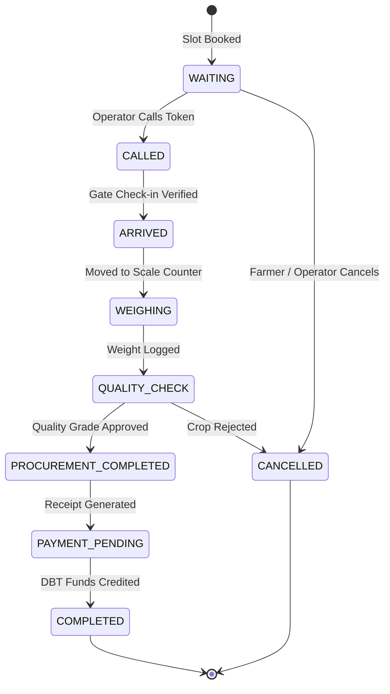
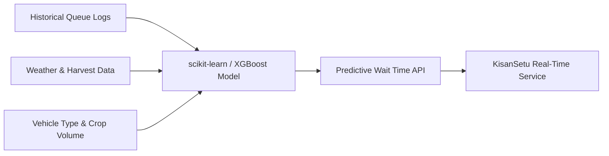

# KisanSetu — Queue Architecture & Wait-Time Algorithm

---

## 1. Queue State Machine & Transition Rules

The procurement queue in KisanSetu operates as a strict deterministic state machine. Every token moves sequentially through validated states.

### State Transition Validation Matrix

| Current State | Next Allowed States | Triggering Role | System Validation Required |
|---|---|---|---|
| `WAITING` | `CALLED`, `CANCELLED` | Operator / Farmer | Token is next in sequence for the slot. |
| `CALLED` | `ARRIVED`, `CANCELLED` | Gate Operator | Scanned QR code at Mandi Gate entry. |
| `ARRIVED` | `WEIGHING` | Scale Operator | Gate check-in timestamp present. |
| `WEIGHING` | `QUALITY_CHECK` | Scale Operator | Gross & Tare weight logged ($Gross > Tare$). |
| `QUALITY_CHECK` | `PROCUREMENT_COMPLETED`, `CANCELLED` | Inspector | Moisture % $\le 14\%$, Grade assigned. |
| `PROCUREMENT_COMPLETED` | `PAYMENT_PENDING` | System | Auto-generated digital procurement receipt. |
| `PAYMENT_PENDING` | `COMPLETED` | Disbursal Officer / API | Bank UTR transaction confirmation received. |

---

## 2. Deterministic Estimated Wait Time (EWT) Formula

During Phase 1, wait time estimation uses a robust, deterministic formula to ensure transparency and predictability.

$$\text{EWT} = \left( \frac{N_{\text{ahead}} \times T_{\text{avg}}}{C_{\text{active}}} \right) + T_{\text{buffer}}$$

Where:
- $N_{\text{ahead}}$ = Number of active tokens ahead in `WAITING` or `ARRIVED` status for that counter type.
- $T_{\text{avg}}$ = Rolling average processing time per farmer (default: 15 minutes per tractor load).
- $C_{\text{active}}$ = Number of currently operational counters at the procurement centre.
- $T_{\text{buffer}}$ = Safety margin buffer (default: 5 minutes).

### Dynamic Re-Calculation Triggers
The system recalculates EWT and broadcasts updated positions via Socket.IO whenever:
1. An operator calls a token (`queue:token_called`).
2. A new counter opens or closes at the mandi (`mandi:counter_change`).
3. A farmer's token is marked `CANCELLED` or `ARRIVED`.

---

## 3. Bottleneck Detection & Congestion Handling

To prevent mandi overcrowding, KisanSetu monitors two key operational metrics:

1. **Queue Congestion Ratio ($R_c$)**:
   $$R_c = \frac{\text{Farmers Currently Waiting}}{\text{Daily Total Mandi Capacity}}$$
   - **Green ($R_c < 0.7$)**: Normal processing flow.
   - **Yellow ($0.7 \le R_c < 0.9$)**: Moderate queue; alert mandi supervisor to open auxiliary counters.
   - **Red ($R_c \ge 0.9$)**: High congestion; auto-restrict further slot bookings for the day and issue SMS advisories to upcoming farmers.

2. **Counter Delay Alert**:
   If a token spends $>30$ minutes in `WEIGHING` or `QUALITY_CHECK` state without progress, an automated alert is triggered on the **Admin Dashboard**.

---

## 4. Future AI / ML Expansion Architecture (Optional Phase 2)

While Phase 1 uses deterministic queue formulas, Phase 2 allows plugging in a **FastAPI + Python ML Service**:

- **Model Goal**: Predict exact individual processing times based on crop moisture levels, vehicle type (Tractor vs Truck), and historical operator throughput.
- **Service Stack**: Python 3.11, FastAPI, scikit-learn, Docker.
