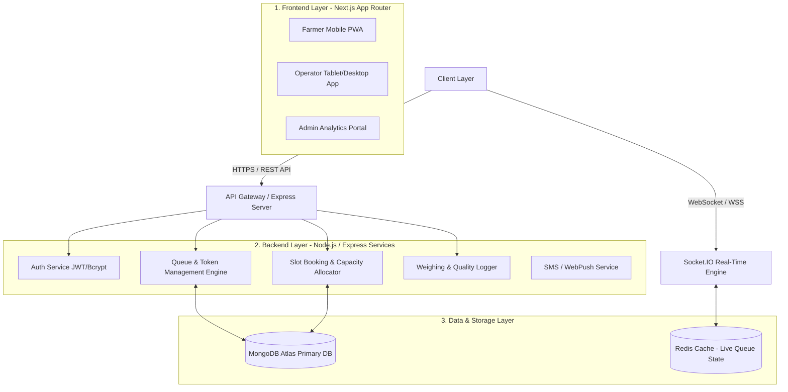

# KisanSetu — Technical Architecture Blueprint

---

## 1. High-Level System Architecture

KisanSetu is structured as a modern, decoupled full-stack architecture optimized for low-latency real-time updates and high-concurrency operation during peak harvesting seasons.

---

## 2. Technology Stack & Responsibilities

| Tier | Technology | Purpose & Responsibility |
|---|---|---|
| **Frontend Framework** | **Next.js 16 (App Router)** | Server-side rendering (SSR), fast client navigation, progressive web app (PWA) capabilities. |
| **Language** | **TypeScript** | End-to-end type safety shared between frontend and backend schemas. |
| **Styling** | **Tailwind CSS + shadcn/ui** | Design system implementation using CSS variables and atomic utility classes. |
| **Real-time Sync** | **Socket.IO** | Bi-directional WebSocket channels for live queue updates and instant counter calls. |
| **Backend Runtime** | **Node.js + Express.js** | Modular REST API endpoints for authentication, bookings, and reporting. |
| **Database** | **MongoDB Atlas + Mongoose** | Flexible, document-oriented database for storing farmers, tokens, and procurement logs. |
| **Validation** | **Zod** | Schema validation for API payloads, forms, and MongoDB document inputs. |
| **Authentication** | **JWT + Bcrypt** | Secure stateless token authentication for Farmers (OTP) and Operators/Admins (Password). |
| **Data Visualization**| **Recharts** | Real-time queue congestion charts and tonnage throughput graphs for Admin portal. |
| **Mapping & Location**| **Leaflet / OpenStreetMap** | Interactive procurement centre location picker for farmers. |

---

## 3. Real-Time Socket.IO Synchronization Architecture

To keep queue positions in sync across hundreds of farmers without polling:

### Socket Rooms Structure
- `mandi:{mandiId}`: Broadcasts mandi-wide announcements and general queue movement.
- `counter:{counterId}`: Subscribes operators to active counter queues.
- `farmer:{farmerId}`: Private channel for individual token status alerts (e.g. `YOUR_TURN_NEXT`, `CALLED_TO_COUNTER_2`).

### Key Socket Events Matrix
| Event Name | Direction | Payload | Trigger |
|---|---|---|---|
| `queue:token_called` | Server $\rightarrow$ Farmer Client | `{ tokenId, counterNum, estTime }` | Operator clicks "Call Next Token". |
| `queue:status_update` | Server $\rightarrow$ Room | `{ mandiId, currentToken, waitingCount }` | Any status change (Arrived, Weighing, Complete). |
| `queue:position_sync` | Server $\rightarrow$ Farmer Client | `{ positionAhead, updatedEWT }` | Periodic or event-driven queue step calculation. |

---

## 4. Offline & Low-Bandwidth Resilience Strategy

For rural farmers with spotty 2G/3G connectivity:

1. **PWA Service Worker Caching**:
   - Application shell (HTML/CSS/JS) cached on first load.
   - Offline fallback page displaying saved active booking tokens.
2. **Local Storage Token Backup**:
   - Token details, QR code payload, and mandi address saved to `localStorage` / `IndexedDB` upon confirmation.
3. **Optimistic UI & Auto-Reconnection**:
   - Queue tracking screen gracefully displays last synced position during temporary connection dropouts.
   - Auto-reconnect exponential backoff for Socket.IO connection.

---

## 5. Security & Data Integrity

- **SMS OTP Authentication**: Farmers log in using mobile number + 4-digit OTP.
- **RBAC (Role-Based Access Control)**:
  - `ROLE_FARMER`: Can only access their own bookings and public mandi slot availability.
  - `ROLE_OPERATOR`: Scoped to assigned procurement centre operations.
  - `ROLE_ADMIN`: District/State wide read & write access.
- **Data Audit Trails**: Critical actions (such as quality grade overrides or weight manual adjustments) write immutable logs to `auditLogs` collection.
