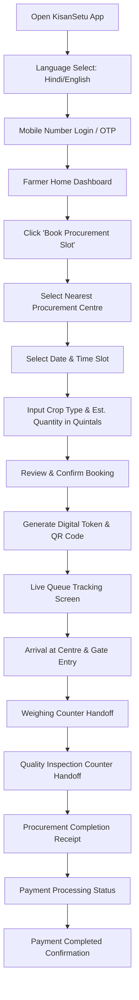
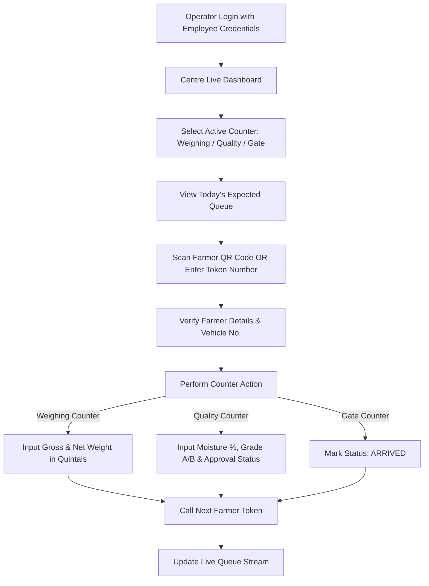
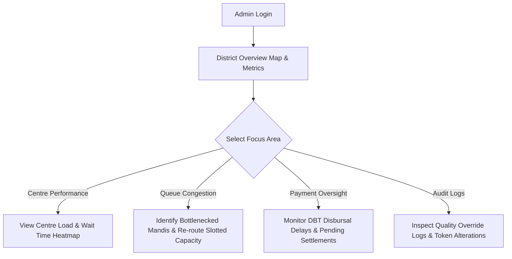

# KisanSetu — User Flows & Journey Blueprint

---

## 1. Core Farmer Journey

The farmer journey is the central operational backbone of KisanSetu. It must require minimal clicks and provide constant reassurance.

### Detailed Farmer Step-by-Step Experience

| Step | Screen | Key Actions & Outputs | UX Reassurance / Language |
|---|---|---|---|
| **1. Onboarding** | Language & Auth Screen | Enter 10-digit mobile number, receive 4-digit OTP. | Large OTP input boxes; automatic SMS detection; "हिंदी में आगे बढ़ें". |
| **2. Home Dashboard** | Farmer Dashboard | Shows active token status card (if booked) or prominent "Book Slot" button. | Quick summary: Centre Name, Date, Slot Time, Current Queue position. |
| **3. Centre Selection** | Centre Finder | Search by District/Pincode or auto-locate nearest mandis. | Distance in KM, operating hours, current load indicator (Green: Normal, Yellow: Busy). |
| **4. Slot & Crop Booking** | Slot Booking Calendar | Pick Available Date $\rightarrow$ Choose Time Window (e.g. 09:00 AM - 11:00 AM) $\rightarrow$ Enter Crop (Paddy/Wheat) & Quantity (e.g. 50 Quintals). | Real-time capacity bar showing remaining quintal allocation for that slot. |
| **5. Token Generation** | Booking Confirmation | Displays Digital Token (e.g. `#KNL-W-104`), QR Code, and downloadable SMS token copy. | Confirmed SMS sent to farmer phone; offline cache saved on local storage. |
| **6. Live Queue Tracking** | Live Queue Screen | Shows live token counter, `3 Farmers Ahead`, `Est. Wait: 25 Mins`, active counter number. | Large animated status ring, voice prompt option, high-contrast queue numbers. |
| **7. Handoff & Completion** | Procurement Tracker | Updates automatically as operator scans QR code: Gate Entry $\rightarrow$ Weighing $\rightarrow$ Quality $\rightarrow$ Payment. | Visual step timeline with green checkmarks for completed stages. |

---

## 2. Procurement Centre Operator Journey

The operator interface is built for high-throughput, error-free operational processing on desktop or tablet.

### Operator Action Matrix

1. **Gate Entry Counter**:
   - Scans farmer token QR code.
   - Verifies tractor/truck vehicle registration number.
   - Updates status to `ARRIVED`. Token moves into active processing line.
2. **Weighing Scale Counter**:
   - Calls token `#KNL-W-104`.
   - Records gross vehicle weight & empty vehicle tare weight.
   - Calculates net crop weight automatically.
   - Updates status to `WEIGHING` $\rightarrow$ Handoff to Quality.
3. **Quality Assessor Counter**:
   - Evaluates moisture percentage, foreign matter, and crop grade.
   - Marks status: `QUALITY_CHECK` (Passed / Rejected / Re-grade).
   - Generates digital Procurement Receipt (J-Form / Receipt).
4. **Disbursement Clerk**:
   - Verifies bank details & MSP (Minimum Support Price) total calculation.
   - Updates status: `PAYMENT_PENDING` $\rightarrow$ Initiates Direct Benefit Transfer (DBT).

---

## 3. Admin / District Officer Journey

The admin portal provides bird's-eye governance over all procurement centres across the district/state.

### Key Admin Tasks & Tools
- **Congestion Heatmap**: Red/Yellow/Green indicators showing mandis operating near 100% capacity.
- **Dynamic Slot Re-allocation**: Adjust daily slot limits for high-demand centres to prevent overcrowding.
- **Payment Delay Alerts**: Highlight procurement orders where payment has been pending for $>48$ hours.
- **Audit & Compliance**: Track quality check overrides or manual token bypasses by operators.
